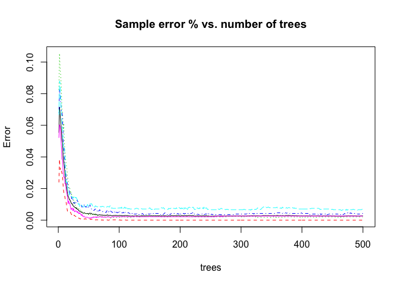

# Practical Machine Learning Prediction Project
**Caner Irfanoglu**
**7/4/2017**

#Introduction
Using devices such as Jawbone Up, Nike FuelBand, and Fitbit it is now possible to collect a large amount of data about personal activity relatively inexpensively. These type of devices are part of the quantified self movement – a group of enthusiasts who take measurements about themselves regularly to improve their health, to find patterns in their behavior, or because they are tech geeks. One thing that people regularly do is quantify how much of a particular activity they do, but they rarely quantify how well they do it. In this project, your goal will be to use data from accelerometers on the belt, forearm, arm, and dumbell of 6 participants. They were asked to perform barbell lifts correctly and incorrectly in 5 different ways. More information is available from the website here: http://groupware.les.inf.puc-rio.br/har (see the section on the Weight Lifting Exercise Dataset).

#Data
The training data for this project are available here:
https://d396qusza40orc.cloudfront.net/predmachlearn/pml-training.csv

The test data are available here:
https://d396qusza40orc.cloudfront.net/predmachlearn/pml-testing.csv


#Purpose

Wearable computing data is consisted of **160 variables including measurements for 5 types of**
**body postures** for 6 different subjects. The purpose of this study is to develop a supervised
machine learning algorithm to **classify which body posture is being performed** with high accuracy.
Steps taken to construct the final algorithm is the scope of the study and it will be finalized with the
predictions on the test data.

#Loading the Data and Required Libraries


```r
library(caret) ; library(nnet) ; library(randomForest) ; library(rpart)
```

The main data is saved under **pmldata** variable and data for test cases is saved as **pmlfinaltest.** 


```r
pathtrain <- file.path("/Users/Caner/Desktop/Data/Coursera-Machine Learning/pml-training.csv") #setting path
pathtest <- file.path("/Users/Caner/Desktop/Data/Coursera-Machine Learning/pml-testing.csv") 
```


```r
pmldata <- read.csv(pathtrain,na.strings=c('#DIV/0!', '', 'NA')) #reading csv files with NA treatment
pmlfinaltest <- read.csv(pathtest,na.strings=c('#DIV/0!', '', 'NA'))
```

#Creating Training and Test Sets

```r
set.seed(42318) #setting seed for reproducibility purposes
```


```r
inTrain <- createDataPartition(y=pmldata$X,p=0.75,list=FALSE) #75-25 % split
pmltrain <- pmldata[inTrain,]
pmltest <- pmldata[-inTrain,]
```

#Data Cleaning and Exploratory Analysis

```r
dim(pmltrain) #training set dimensions before cleaning
```

```
## [1] 14718   160
```

```r
dim(pmltest) #test set dimensions before cleaning
```

```
## [1] 4904  160
```

Removing variables with > 95% NA


```r
NAratiosbycolumn <- sapply(pmltrain,function(x){sum(is.na(x))/length(pmltrain$X)})
NAmore95 <- which(NAratiosbycolumn > 0.95)
pmltrain <- pmltrain[,-NAmore95] 
pmltest <- pmltest[,-NAmore95]
```

Removing nearzero-variance variables

```r
lowvar <- nearZeroVar(pmltrain)
pmltrain <- pmltrain[,-lowvar] 
pmltest <- pmltest[,-lowvar]
```

Removing non-related to Prediction variables 

```r
pmltrain <- pmltrain[,-c(1:5)]
pmltest <- pmltest[,-c(1:5)]
dim(pmltrain) #training set dimensions after cleaning
```

```
## [1] 14718    54
```

```r
dim(pmltest) #testing set dimensions after cleaning
```

```
## [1] 4904   54
```

```r
str(pmltrain$classe) #Features of the dependent variable (prediction variable)
```

```
##  Factor w/ 5 levels "A","B","C","D",..: 1 1 1 1 1 1 1 1 1 1 ...
```

#Model Creation
As it can be seen on the exploratory analysis, the prediction variable classe is a categorical 
variable with 5 possible outcomes. To classify, the outcome accurately logistic regression can be used.
Since, the outcome is non-binary, multinomial logistic regression will be applied first.

###Trying logistic regression 

```r
fit_log <- multinom(classe ~ .,data = pmltrain)
```

```
## # weights:  275 (216 variable)
## initial  value 23687.707195 
## iter  10 value 18716.980646
## iter  20 value 16299.732754
## iter  30 value 15117.884572
## iter  40 value 14222.316270
## iter  50 value 13670.609619
## iter  60 value 13331.935399
## iter  70 value 13140.724723
## iter  80 value 12996.439875
## iter  90 value 12912.550968
## iter 100 value 12836.254843
## final  value 12836.254843 
## stopped after 100 iterations
```

```r
pred_log <- predict(fit_log,pmltest)
acc_log <- confusionMatrix(pred_log,pmltest$classe)
acc_log
```

```
## Confusion Matrix and Statistics
## 
##           Reference
## Prediction    A    B    C    D    E
##          A 1141  128  124   66   65
##          B   61  561   75   34  103
##          C   61   94  532   95   77
##          D  130   82   80  583  109
##          E   12   83   35   31  542
## 
## Overall Statistics
##                                           
##                Accuracy : 0.685           
##                  95% CI : (0.6717, 0.6979)
##     No Information Rate : 0.2865          
##     P-Value [Acc > NIR] : < 2.2e-16       
##                                           
##                   Kappa : 0.6005          
##  Mcnemar's Test P-Value : < 2.2e-16       
## 
## Statistics by Class:
## 
##                      Class: A Class: B Class: C Class: D Class: E
## Sensitivity            0.8121   0.5918   0.6288   0.7206   0.6049
## Specificity            0.8905   0.9310   0.9194   0.9021   0.9598
## Pos Pred Value         0.7487   0.6727   0.6193   0.5925   0.7710
## Neg Pred Value         0.9219   0.9049   0.9224   0.9423   0.9157
## Prevalence             0.2865   0.1933   0.1725   0.1650   0.1827
## Detection Rate         0.2327   0.1144   0.1085   0.1189   0.1105
## Detection Prevalence   0.3108   0.1701   0.1752   0.2007   0.1434
## Balanced Accuracy      0.8513   0.7614   0.7741   0.8114   0.7824
```

The following results indicate that the multinomial logistic model has around **68.5%** accuracy. 

###Trying regression tree

```r
fit_rpart  <- rpart(classe ~ .,data = pmltrain)
pred_rpart <- predict(fit_rpart,pmltest,type = "class")
acc_rpart <- confusionMatrix(pred_rpart,pmltest$classe)
acc_rpart
```

```
## Confusion Matrix and Statistics
## 
##           Reference
## Prediction    A    B    C    D    E
##          A 1291  220   34   63   36
##          B   58  541   38   39   32
##          C    7   74  678  120   58
##          D   31   56   39  455   38
##          E   18   57   57  132  732
## 
## Overall Statistics
##                                           
##                Accuracy : 0.7539          
##                  95% CI : (0.7416, 0.7659)
##     No Information Rate : 0.2865          
##     P-Value [Acc > NIR] : < 2.2e-16       
##                                           
##                   Kappa : 0.6865          
##  Mcnemar's Test P-Value : < 2.2e-16       
## 
## Statistics by Class:
## 
##                      Class: A Class: B Class: C Class: D Class: E
## Sensitivity            0.9189   0.5707   0.8014  0.56242   0.8170
## Specificity            0.8991   0.9578   0.9362  0.95995   0.9341
## Pos Pred Value         0.7853   0.7641   0.7236  0.73506   0.7349
## Neg Pred Value         0.9650   0.9030   0.9577  0.91739   0.9580
## Prevalence             0.2865   0.1933   0.1725  0.16497   0.1827
## Detection Rate         0.2633   0.1103   0.1383  0.09278   0.1493
## Detection Prevalence   0.3352   0.1444   0.1911  0.12622   0.2031
## Balanced Accuracy      0.9090   0.7642   0.8688  0.76119   0.8755
```

By using a regression tree accuracy is increased to **74** %. 

###Trying random forest

```r
fit_rf <- randomForest(classe ~ ., data = pmltrain)
pred_rf <- predict(fit_rf,pmltest)
acc_rf <- confusionMatrix(pred_rf,pmltest$classe) 
acc_rf
```

```
## Confusion Matrix and Statistics
## 
##           Reference
## Prediction    A    B    C    D    E
##          A 1405    1    0    0    0
##          B    0  947    4    0    0
##          C    0    0  842    4    0
##          D    0    0    0  805    2
##          E    0    0    0    0  894
## 
## Overall Statistics
##                                          
##                Accuracy : 0.9978         
##                  95% CI : (0.996, 0.9989)
##     No Information Rate : 0.2865         
##     P-Value [Acc > NIR] : < 2.2e-16      
##                                          
##                   Kappa : 0.9972         
##  Mcnemar's Test P-Value : NA             
## 
## Statistics by Class:
## 
##                      Class: A Class: B Class: C Class: D Class: E
## Sensitivity            1.0000   0.9989   0.9953   0.9951   0.9978
## Specificity            0.9997   0.9990   0.9990   0.9995   1.0000
## Pos Pred Value         0.9993   0.9958   0.9953   0.9975   1.0000
## Neg Pred Value         1.0000   0.9997   0.9990   0.9990   0.9995
## Prevalence             0.2865   0.1933   0.1725   0.1650   0.1827
## Detection Rate         0.2865   0.1931   0.1717   0.1642   0.1823
## Detection Prevalence   0.2867   0.1939   0.1725   0.1646   0.1823
## Balanced Accuracy      0.9999   0.9990   0.9971   0.9973   0.9989
```


```r
plot(fit_rf,main = "Sample error % vs. number of trees")
```

<!-- -->

By using a random forest model an accuracy of **99.67** % is achieved.Also, **expected out of sample error is calculated as 0.0033**.Since random forest provides higher accuracy, sensitivity and specificity  it is chosen as the appropriate model fit for the prediction.

#Cross Validation
Since the first two models are not chosen, cross validation is not done.Breiman & Cutler, n.d.
stated that, in random forests, **there is no need for cross-validation or a separate test set to get an unbiased estimate of the test set error. It is estimated internally, during the run**, as follows:
Each tree is constructed using a different bootstrap sample from the original data. About one-third of the cases are left out of the bootstrap sample and not used in the construction of the kth tree.


#Predicting Test Set and Saving Results

```r
pred_test <- predict(fit_rf,pmlfinaltest)
pred_test
```

```
##  1  2  3  4  5  6  7  8  9 10 11 12 13 14 15 16 17 18 19 20 
##  B  A  B  A  A  E  D  B  A  A  B  C  B  A  E  E  A  B  B  B 
## Levels: A B C D E
```


```r
pmlwrite = function(x){
    l = length(x)
        filename = paste0("predictions.txt") #results are written in predictions.txt in the current dir.
        write.table(x[1:l],file=filename,quote=FALSE,row.names=FALSE,col.names=FALSE)
    
}

#pml_write_files(pred_test)
```

#References

* Random Forests Leo Breiman and Adele Cutler. (n.d.). Retrieved April 07, 2017, from https://www.stat.berkeley.edu/~breiman/RandomForests/cc_home.htm#ooberr

* Ugulino, W.; Cardador, D.; Vega, K.; Velloso, E.; Milidiu, R.; Fuks, H. Wearable Computing: Accelerometers' Data Classification of Body Postures and Movements. Proceedings of 21st Brazilian Symposium on Artificial Intelligence. Advances in Artificial Intelligence - SBIA 2012. In: Lecture Notes in Computer Science. , pp. 52-61. Curitiba, PR: Springer Berlin / Heidelberg, 2012. ISBN 978-3-642-34458-9. DOI: 10.1007/978-3-642-34459-6_6.

Thank you for being kind enough to share your research with public.


